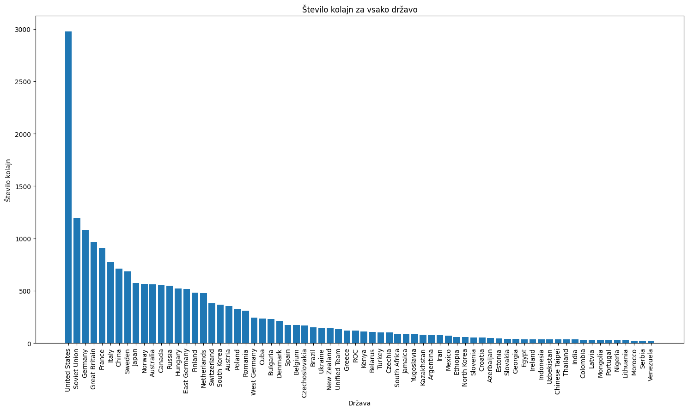

# Olimpijske medalje: Analiza uspeha držav in športnikov

Avtorji: Andrej Skočir, Anton Martin Turk, Miha Kavs

Šolsko leto: 2023/24

## Opis problematike

Ti podatki predstavljajo informacije o podeljenih medaljah na olimpijskih igrah, vključno z državami dobitnicami, disciplinami, v katerih so bile medalje podeljene, vrsto medalje, ime olimpijskega mesta, leto olimpijskih iger, sezono (poletne ali zimske), spolom zmagovalca, oznako države, komitejem in vrsto komiteja.
Poleg tega lahko s pomočjo teh podatkov razvijemo vizualizacije, ustvarimo modele in izvedemo različne statistične analize za razumevanje trendov in vzorcev v rezultatih olimpijskih iger. Ključno je upoštevati morebitne izzive, kot so nekonsistentnost imen držav, ki lahko vplivajo na natančnost in interpretacijo analiz.

## Problemi podatkov

Problem pri teh podatkih je lahko v nedosledni ali nepopolni obliki imen držav. To lahko vključuje različne oblike imen iste države (na primer "Slovenia", "SLO", "Slovenija") ali pa prisotnost različnih imen za isto državo zaradi sprememb imen ali teritorialnih sprememb skozi čas (Jugoslavija). Ta nekonsistentnost v imenovanju lahko povzroči težave pri iskanju in primerjanju podatkov med različnimi viri ali pri izvajanju analize podatkov. Pomembno je, da se te težave prepoznajo in obravnavajo pri delu s podatki, da se zagotovi natančna in zanesljiva analiza.

Problem je v tem, da so podatki o zmagovalcih zelo raznoliki in vključujejo tako posamezne športnike kot tudi ekipe ali skupine športnikov. To lahko povzroči težave pri analizi podatkov na ravni posameznega tekmovalca, saj so nekateri zmagovalci zapisani kot države, drugi pa kot imena ekip ali skupin športnikov.

Zaradi tega je težko dobiti natančne podatke o uspehu posameznega tekmovalca, saj moramo najprej ločiti posamezne tekmovalce od ekip ali skupin športnikov v podatkih. To zahteva dodatno obdelavo podatkov, kot je filtriranje ali razvrščanje po določenih kriterijih, kar lahko včasih privede do izgube ali nepopolnih informacij.

Poleg tega lahko raznolikost v zapisu zmagovalcev oteži primerjavo ali združevanje podatkov med različnimi viri ali obdobji, kar lahko vpliva na celovitost in zanesljivost analiz. Zato je pomembno, da se zavedamo teh izzivov in uporabimo ustrezne tehnike obdelave podatkov za dosego želenih analitičnih ciljev.

## Glavne ugotovitve

Ugotovitev prevlade ZDA na olimpijskih igrah in presenečenja v uspehu nekaterih držav temelji na analizi podatkov o podeljenih medaljah. Za ugotovitev, da ZDA prevladujejo, smo najprej izračunali skupno število medalj, ki jih je prejela vsaka država. Nato smo te podatke razvrstili in ugotovili, da ZDA imajo skoraj dvakrat več medalj kot drugouvrščena država. 

Kar zadeva presenečenja, smo na podoben način analizirali število medalj za vsako državo. Ko smo primerjali število medalj, ki so jih prejele države, smo opazili, da so nekatere države, kot so Madžarska in Bolgarija, dosegle visoko število medalj, ki je bilo morda višje od pričakovanj. Nasprotno pa smo ugotovili, da so druge države, na primer Španija in Brazilija, dosegle bistveno manj medalj, kar je bilo morda manj pričakovano glede na njihov običajni uspeh na preteklih olimpijskih igrah. Te ugotovitve so lahko posledica različnih dejavnikov, vključno z naložbami v šport, uspešnostjo športnikov, pripravo ekip in druge pomembne dejavnike, ki vplivajo na izid tekmovanj na olimpijskih igrah.

## Povzetek

Podatki o podeljenih medaljah na olimpijskih igrah ponujajo obsežen vpogled v uspeh držav, discipline, športnikov in ekip. Kljub temu se soočamo z izzivi, kot so nekonsistentnost imen držav, kar otežuje primerjavo podatkov med različnimi viri, in raznolikost v zapisu zmagovalcev, kar otežuje analizo uspeha posameznih tekmovalcev. Kljub tem izzivom analiza podatkov razkriva prevlado ZDA na olimpijskih igrah ter presenetljive dosežke nekaterih držav, kar odraža kompleksnost in dinamiko športnih tekmovanj na najvišji ravni.
